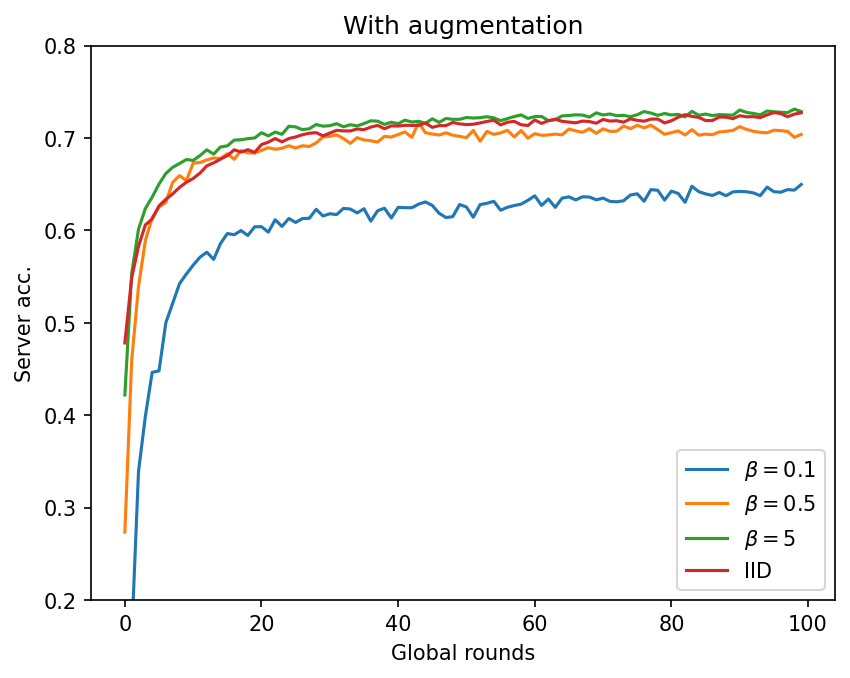

# FedAvg

> McMahan, Brendan, Eider Moore, Daniel Ramage, Seth Hampson, and Blaise Aguera y Arcas. "Communication-efficient learning of deep networks from decentralized data." In *Artificial intelligence and statistics*, pp. 1273-1282. PMLR, 2017.


## Experiment Details

The following hyper-parameters are fixed for all experiments:

- Number of clients: 10

- Communication rounds: 100

- Local epochs: 10

- Batch size: 64

- Network architecture (SimpleCNN):

  ```
  conv(3, 6, 5) + relu + maxpool
  conv(6, 16, 5) + relu + maxpool
  linear(400, 120) + relu
  linear(120, 84) + relu
  linear(84, 10)
  ```

- Optimizer: SGD

  - learning rate: 0.01
  - weight decay: 0.00001
  - momentum: 0.9

I use two kinds of data partition methods: `IID` and `Dirichlet`.

- `IID`: The original data is random shuffled and then evenly distributed to each client.
- `Dirichlet`: The data of each class is distributed to every clients according to Dirichlet distribution with parameter $\beta$. Smaller $\beta$ means more skewed data.


## Results on CIFAR-10

Note: Without data augmentation (`RandomCrop` and `RandomHorizontalFlip`), the result is very low due to **overfitting**.

