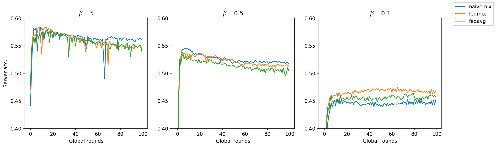

# FedMix

> Yoon, Tehrim, Sumin Shin, Sung Ju Hwang, and Eunho Yang. "Fedmix: Approximation of mixup under mean augmented federated learning." *arXiv preprint arXiv:2107.00233* (2021).

:warning: The result doesn't meet expectation. There may be bugs in code.


## Experiment Details

The following hyper-parameters are fixed for all experiments:

- Number of clients: 10
- Communication rounds: 100
- Local epochs: 10
- Batch size: 64
- Network architecture (SimpleCNN):
  ```
  conv(3, 6, 5) + relu + maxpool
  conv(6, 16, 5) + relu + maxpool
  linear(400, 120) + relu
  linear(120, 84) + relu
  linear(84, 10)
  ```
- Optimizer: SGD
  - learning rate: 0.01
  - weight decay: 0.00001
  - momentum: 0.9


Non-IID data is generated using Dirichlet distribution with parameter $\beta$. Smaller $\beta$ means more skewed data.


For FedMix, $\lambda$ is set to 0.05 and $M_k$ (number of data instances used for computing the average) is 5.

For NaiveMix, $\lambda$ is set to 0.1 and $M_k$ is 5.


## Results on CIFAR-10

Comparison among FedMix, NaiveMix and FedAvg:



Expected result is FedMix > NaiveMix > FedAvg. However, it's not the case from the figure above. There may be bugs in code.